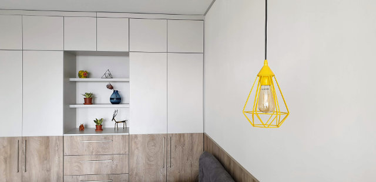
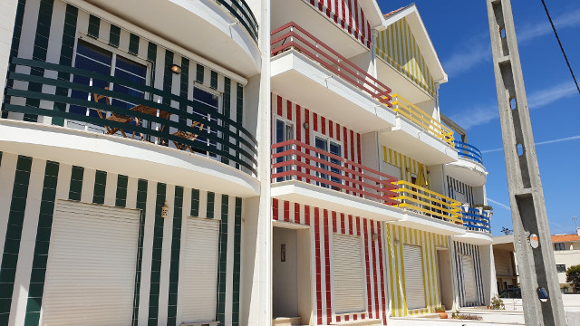

As this is a tech blog, a hello world post seems appropriate. What better way to start than describing my approach to building my blog from scratch. I decided to not use an existing platform just for the fun of being able to learn some new things while building the blog itself.

Overall my initial goal is to publish this as a static blog on GitHub Pages, with an infrastructure that will help me write my first 10 blog posts.

## Writing experience

I want my blog to be version controlled and saved in plain text. Markdown is a familiar format for me, and comes with all the features I think I need for writing my articles about development. Should I need more features I should be able to migrate from markdown to something else pretty easy, using something like [pandoc](https://pandoc.org/).

CommonMark markdown is to me the easiest choice, as it seems to be a common supported flavor by VS Code, Pandoc, and Github.

Next up I need to use an editor. My only requirement for now is spell-checking, and a minimal of visualization to know my markdown is correctly formatted. For this need Visual Studio Code with [Spell Right](https://marketplace.visualstudio.com/items?itemName=ban.spellright) extension seems to do the trick.

## File structure (source and target)

Each post may consist of:

-  A markdown file
-  Assets related to the article
-  Article metadata

To accommodate this let's create file structure:

- `<name-of-post>`
  - `<name-of-post>.md`
  - `assets/`
  - `metadata.json`

Keeping the name of the post dynamic to match the parent folder, allows me to edit multiple articles and still see what I'm editing.

Each post should be published to provide nice URLs like `/<name-of-post>`.

Should eventually the build output should end up with:

- `<name-of-post>/`
  -  `index.html`
  -  `assets/`

Which should make the post accessible at `/<name-of-post>`.

## Compile markdown to HTML

For building a blog I will need to create a website with some static pages and somehow compile each blog post into a page which fits the overall design of the website. Each markdown file should be compiled to unique HTML pages.

VS code comes with a build-in preview mode. VS Code uses [markdown-it](https://markdown-it.github.io/), and I have decided to jump on board an use the same for automating the generation of my static web pages.

As this is a tech-blog I will also configure the [highlight.js](https://highlightjs.org/) plugin for `markdown-it`, to support good code highlighting.

A naïve implementation for compiling the markdown will work for now. This version display the code used for compiling a all posts in `/posts` folder to the `public` folder. I don't have any `assets/` for this blog post nor do I have a `metadata.json` file, so will skip that part until it's needed.

The script for locating and compiling the markdown files look like the following:

```js
const MarkdownIt = require('markdown-it');
const fs = require('fs');
const path = require('path');
const hljs = require('highlight.js');

const md = new MarkdownIt('commonmark', {
  highlight: function (str, lang) {
    if (lang && hljs.getLanguage(lang)) {
      try {
        return hljs.highlight(lang, str).value;
      } catch (__) { }
    }
    // use external default escaping
    return '';
  }
});
const posts = fs.readdirSync('posts/');

posts.forEach(async (nameOfPost) => {
  const pathToMdPost = path.resolve(
    'posts',
    nameOfPost,
    nameOfPost + '.md'
  );

  const mdContent = await fs.promises.readFile(
    pathToMdPost,
    { encoding: 'utf8' }
  );

  const postHtml = md.render(mdContent);
  
  await fs.promises.rmdir(
    'public/posts',
    { recursive: true }
  );

  await fs.promises.mkdir(
    `public/posts/${nameOfPost}`,
    { recursive: true }
  );

  await fs.promises.writeFile(
    `public/posts/${nameOfPost}/index.html`,
    postHtml
  );
});
```

## Templating

The build output of each compiled markdown is an HTML fragment. To add design and a website layout elements like header, navigation and footer we must inline the content into a post layout template.

For this task, I have to choose between using an existing templating engine or use simple string replacements.

Lets begin with creating an HTML template, in which each blog post is added. I will use the syntax the style of [mustache](http://mustache.github.io) like  `{{variable}}` to insert things into the template.

I imagine a template like the following for each post:

```html
<header>
  <a href="/">Larm [lɑːˀm]</a>
</header>

<main>
  <article>
    <header>
      <h1>{{title}}</h1>
    </header>

    {{content}}
  </article>
</main>
```
Doing a simple string replacement, works for me here, and no need for a template engine yet. I am sure using the templating engine is faster for me to get up and running and will serve me well, but where is the fun in that. Moving to a template engine later should be possible without too big changes.

Here is a snippet of replacing some variables in the template with appropriate content:

```js
const htmlContent = htmlTemplate
  .replace(/{{title}}/g, metadata.title)
  .replace(/{{content}}/, postHtml);
```

Simple, but effective!

## Reading Experience

One of the most important parts of the styling for any blog is without a doubt the font, font-size and the length of the paragraph.

I like a good semi-big font-size for reading. 16px seems to be a general good size. I would like to see just under 100 characters per paragraph. As I am using the `'Source Sans Pro'` font, this means I will need a maximum paragraph around 640px.

For me being able to display code is also a real challenge. Because of the font-size, and paragraph size. If my code snippets have the same constraints, then I will have to limit my code snippets to maximum 65 characters, to avoid horizontal scrollbars.

To understand when my snippets will cause horizontal scrollbars for users with screens bigger than 640px, I have configured my writing environment to display a horizontal ruler. I could use a tooling like [prettier](https://prettier.io/) to enforce the rule on in my code. But I prefer my actual code to have longer lines, so I will have to correct these line manually for now. 

Phone users in portrait-mode will have a struggle to see many the code snippets. And here I don't see a better option that to enforce a horizontal scrollbar, and keep in mind to keep my snippets simplified and as short as possible, while keeping it readable for desktop users. Most phones will be able to display a scroll-free version of the snippets in landscape mode, which I think is an acceptable compromise.

## Visual Design

I will admit, designing is not my strongest asset. At first I wanted to go with super simplistic reading experience, much like you would find in Firefox's reading mode, or something similar to the styling on write.as.

As I was reading the blog [ev.ee](https://eev.ee) I realized how cool it was with some personal styling for a blog.

To make this blog more personal, I decided to use a color scheme close to the colors of my apartment.



Combining that with the designs of the striped beach houses of Costa Nova in Portugal, (thanks to my lovely girlfriends suggestion) which we experienced on a holiday, I managed to add some texture to the blog design, and give it a more welcoming friendly design.




Also as a vivid board gamer, I usually pick yellow as my color, so I'm quite happy with using a bright yellow color for the design to represent my writing. 
